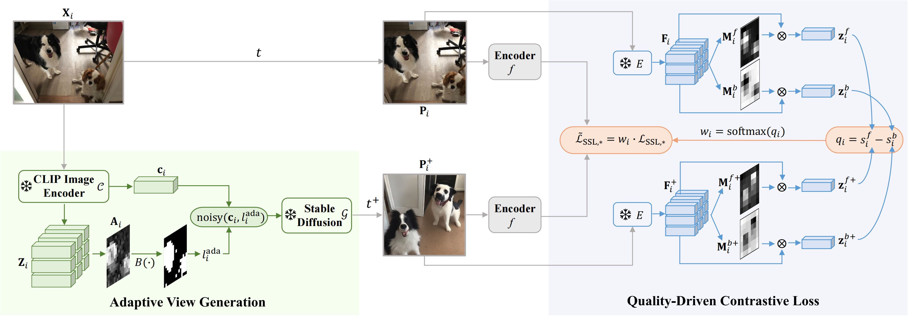

# Official PyTorch Implementation of GenView



This repository is the official implementation of "GenView: Enhancing View Quality with Pretrained Generative Model for Self-Supervised Learning".

> **[GenView: Enhancing View Quality with Pretrained Generative Model for Self-Supervised Learning](https://arxiv.org/abs/2403.12003)**<br> 
> Xiaojie Li^1,2, [Yibo Yang](https://iboing.github.io/)^3, [Xiangtai Li](https://lxtgh.github.io/)^4, [Jianlong Wu](https://jlwu1992.github.io)^1, [Yue Yu](https://yuyue.github.io)^2, [Bernard Ghanem](https://www.bernardghanem.com/)^3, [Min Zhang](https://zhangminsuda.github.io)^1<br>
> ^1Harbin Institute of Technology, Shenzhen, ^2Peng Cheng Laboratory, ^3King Abdullah University of Science and Technology, ^4Nanyang Technological University

## 🔨 Installation

**Step 1: Create and Activate a Conda Environment**

Create a new Conda environment named `env_genview` with Python 3.8, and activate it:

```shell
conda create --name env_genview python=3.8 -y
conda activate env_genview
```

**Step 2: Install Required Packages**

Install PyTorch, torchvision, torchaudio, and other necessary packages using pip or Conda. Choose the installation command based on your preference and GPU compatibility:

```shell
# Using pip
pip install torch==2.0.1+cu117 torchvision==0.15.2+cu117 torchaudio==2.0.2 --index-url https://download.pytorch.org/whl/cu117

# Or using conda
conda install pytorch==2.0.1 torchvision==0.15.2 torchaudio==2.0.2 pytorch-cuda=11.7 -c pytorch -c nvidia

# Install timm, open_clip and diffusuers
pip install timm=0.9.7 open_clip==2.22.0 diffusers==0.21.4
```

**Step 3: Clone Repository and Install Dependencies**

After cloning the repository, navigate to the `genview` directory and use `openmim` to install project dependencies:

```shell
git clone <repository_url>  # Replace <repository_url> with the actual URL of the repository.
cd genview
pip install -U openmim
mim install -e .
```

**For Quick Environment Setup**

Execute the provided script to automate the environment setup. This script also updates specific files in the `open_clip` and `timm` packages with our customized versions:

```shell
sh tools/toolbox_genview/deploy_env.sh
```

Additionally, to apply our modifications to `open_clip` and `timm`, run:

```shell
sh tools/toolbox_genview/change_openclip_timm.sh
```

## ➡️ Data Preparation

Prepare and generate adaptive view generation data based on ImageNet.

**Step 1: Extract CLIP Features**

Extract and save features for each image using CLIP, then perform PCA analysis. See `tools/clip_pca/README.md` for more details:

```shell
python tools/clip_pca/extract_features_pca.py --input-list /path/to/image_list.txt --output-dir /path/to/output
```

Outputs are saved in `features/` and `eigenvalues/` directories.

**Step 2: Determine Suitable Noise Levels**

Select the appropriate noise level for each image to maintain semantic consistency while ensuring diversity. Generate 'fg_ratios.txt' in the specified output directory:
```shell
python tools/clip_pca/calculate_fgratio.py --input-list /path/to/your/image_list.txt --output-dir /path/to/output_directory
```
Distribute the original fg_ratios.txt entries into separate files based on the specified ranges and mapping values. Each output file is named after its corresponding mapped value (e.g., fg_ratios_0.txt, fg_ratios_100.txt, etc.), containing image paths and their fg_ratio values that fall into the respective ranges. 
```shell
python tools/clip_pca/generate_ada_noise_level.py --input-file /path/to/your/fg_ratios.txt --output-dir /path/to/your/fg_ratios_{noise_level}.txt
```

**Step 3: Generate Conditioned Image Dataset and Final List**

Use the following commands to generate image variations and compile the dataset list:

```shell
sh tools/toolbox_genview/generate_image_variations_noiselevels.sh /path/to/your/fg_ratios_{noise_level}.txt /path/to/datasets/imagenet/train_variations/ /path/to/datasets/imagenet/train/ {noise_level}
# Repeat for other fg_ratios_*.txt files with corresponding noise levels
```

**For Quick Data Preparation**

If you prefer not to generate data yourself, we will provide pre-generated data (train_variations.tar.*, coming soon) based on ImageNet.

Merge and extract the training data:
```shell
cd /path/to/download_tars/
cat train_variations.tar.* > train_variations.tar
tar -xvf train_variations.tar
```

The directory structure under `train_variations` mirrors that of `imagenet/train`.

Create Dataset Symlinks in the `genview` directory:

```shell
cd genview
mkdir -p data/imagenet
cd data/imagenet
ln -s /path/to/imagenet/train .
ln -s /path/to/imagenet/val .
ln -s /path/to/download_tars/train_variations/ .
```

Generate the synthetic image list using `generate_train_variations_list.py`:

```shell
python tools/toolbox_genview/generate_train_variations_list.py --input-dir /path/to/train_variations --output-list data/imagenet/train_variations.txt
```

## 🔄 Training

Detailed commands for running pretraining and downstream tasks with single or multiple machines/GPUs:

**Training with Multiple GPUs**
```shell
CUDA_VISIBLE_DEVICES=0,1,2,3,4,5,6,7 PORT=29500 bash tools/dist_train.sh ${CONFIG_FILE} 8 [PY_ARGS] [--resume /path/to/latest/epoch_{number}.pth]
```

**Training with Multiple Machines**
```shell
CPUS_PER_TASK=8 GPUS_PER_NODE=8 GPUS=16 sh tools/slurm_train.sh $PARTITION $JOBNAME ${CONFIG_FILE} $WORK_DIR [--resume /path/to/latest/epoch_{number}.pth]
```

Ensure to replace `$PARTITION`, `$JOBNAME`, and `$WORK_DIR` with actual values for your setup.

## 🚀 Experiments

The following experiments provide various pretraining setups using different architectures, epochs, and GPU configurations.

**SimSiam + ResNet50 + 200 Epochs + 8 GPUs**

- **Pretraining**:
  ```shell
  CPUS_PER_TASK=8 GPUS_PER_NODE=8 GPUS=8 sh tools/slurm_train.sh $PARTITION simsiam_pretrain configs/simsiam/simsiam_resnet50_8xb32-coslr-200e_in1k_singleview_clipmask.py work_dirs/simsiam_resnet50_8xb32-coslr-200e_in1k_singleview_clipmask
  ```
- **Linear Probe**:
  ```shell
  CPUS_PER_TASK=8 GPUS_PER_NODE=8 GPUS=8 sh tools/slurm_train.sh $PARTITION simsiam_linear configs/simsiam/benchmarks/resnet50_8xb512-linear-coslr-90e_in1k_clip.py work_dirs/simsiam_resnet50_8xb32-coslr-200e_in1k_diffssl_prob1_128w_clipmask/linear --cfg-options model.backbone.init_cfg.checkpoint=work_dirs/simsiam_resnet50_8xb32-coslr-200e_in1k_diffssl_prob1_128w_clipmask/epoch_200.pth
  ```
  
**MoCo v3 + ResNet50 + 100 Epochs + 8 GPUs**

- **Pretraining**:
  ```shell
  CPUS_PER_TASK=8 GPUS_PER_NODE=8 GPUS=8 sh tools/slurm_train.sh $PARTITION mocov3r50_pretrain configs/mocov3/mocov3_resnet50_8xb512-amp-coslr-100e_in1k_singleview_clipmask.py work_dirs/mocov3_resnet50_8xb512-amp-coslr-100e_in1k_singleview_clipmask
  ```
  
- **Linear Probe**:
  ```shell
  CPUS_PER_TASK=8 GPUS_PER_NODE=8 GPUS=8 sh tools/slurm_train.sh $PARTITION mocov3r50_linear configs/mocov3/benchmarks/resnet50_8xb128-linear-coslr-90e_in1k_clip.py work_dirs/mocov3_resnet50_8xb512-amp-coslr-100e_in1k_singleview_clipmask/linear --cfg-options model.backbone.init_cfg.checkpoint=work_dirs/mocov3_resnet50_8xb512-amp-coslr-100e_in1k_singleview_clipmask/epoch_100.pth
  ```

**MoCo v3 + ViT-B + 300 Epochs + 16 GPUs**

- **Pretraining**:
  ```shell
  CPUS_PER_TASK=8 GPUS_PER_NODE=8 GPUS=16 sh tools/slurm_train.sh $PARTITION mocov3vit_pretrain configs/mocov3/mocov3_vit-base-p16_16xb256-amp-coslr-300e_in1k_singleview_clipmask.py work_dirs/mocov3_vit-base-p16_16xb256-amp-coslr-300e_in1k_singleview_clipmask
  ```

- **Linear Probe**:
  ```shell
  CPUS_PER_TASK=8 GPUS_PER_NODE=8 GPUS=8 sh tools/slurm_train.sh $PARTITION mocov3vit_linear configs/mocov3/benchmarks/vit-base-p16_8xb128-linear-coslr-90e_in1k_clip.py work_dirs/mocov3_vit-base-p16_16xb256-amp-coslr-300e_in1k_singleview_clipmask/linear --cfg-options model.backbone.init_cfg.checkpoint=work_dirs/mocov3_vit-base-p16_16xb256-amp-coslr-300e_in1k_singleview_clipmask/epoch_300.pth
  ```
  
## 📍 Model Zoo
Coming soon.

## ✏️ Citation
If you find the repo useful for your research, please consider citing our paper:
```bibtex
@inproceedings{li2023genview,
  author={Li, Xiaojie and Yang, Yibo and Li, Xiangtai and Wu, Jianlong and Yu, Yue and Ghanem, Bernard and Zhang, Min},
  title={GenView: Enhancing View Quality with Pretrained Generative Model for Self-Supervised Learning}, 
  year={2024},
  booktitle={arXiv preprint arXiv:2403.12003},
}
```
## 🔒 License

This project is released under the [Apache 2.0 license](LICENSE).

## 👍 Acknowledgments

This codebase builds on [mmpretrain](https://github.com/open-mmlab/mmpretrain). Thanks to the contributors of this great codebase.